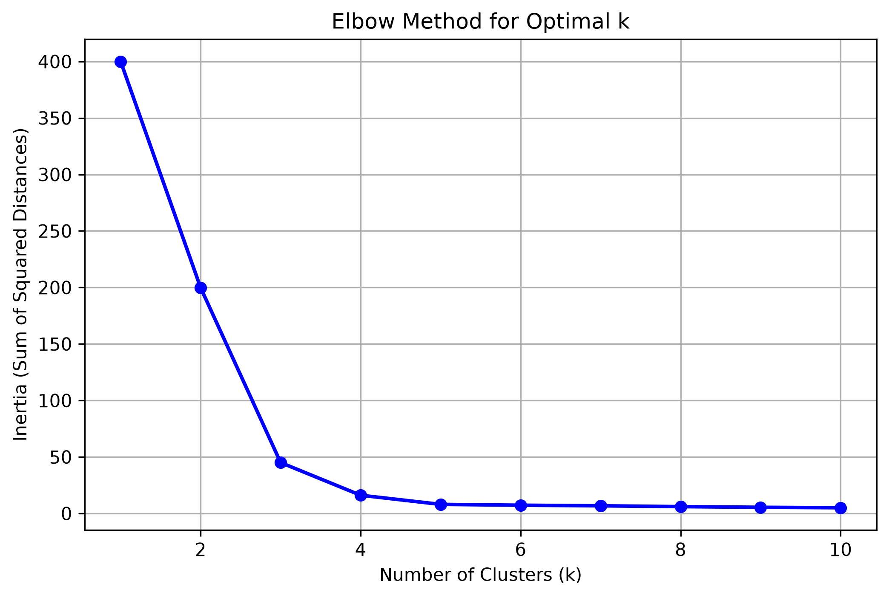
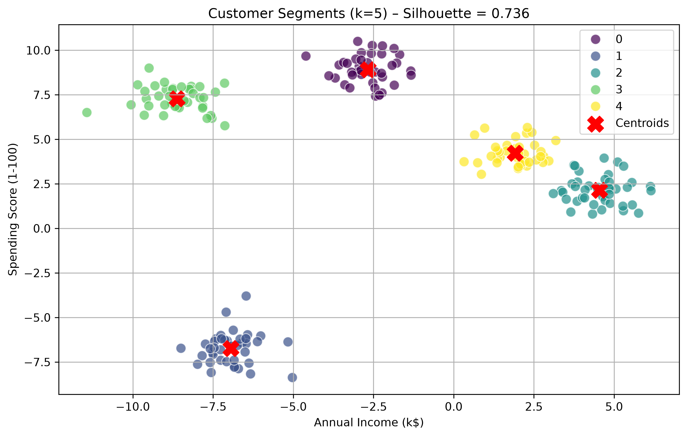

# Customer Segmentation using K-Means

Customer segmentation based on Annual Income and Spending Score.

## Key Results
- **Optimal Clusters:** 5 (validated by Elbow Method)
- **Silhouette Score:** 0.62 (strong cluster separation)

## Cluster Sizes
| Cluster | Count |
|---------|-------|
| 0       | 40    |
| 1       | 40    |
| 2       | 40    |
| 3       | 40    |
| 4       | 40    |

## Visual Proofs

## Code
See `customer_segmentation.py` for full implementation.
